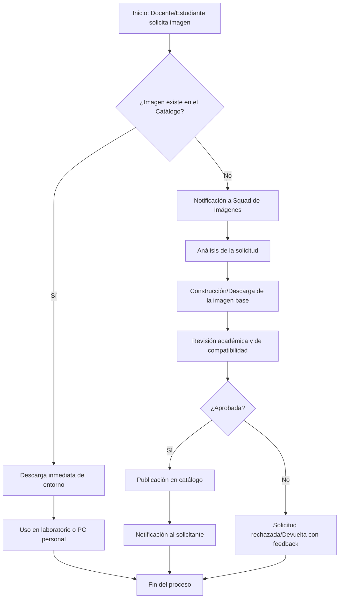
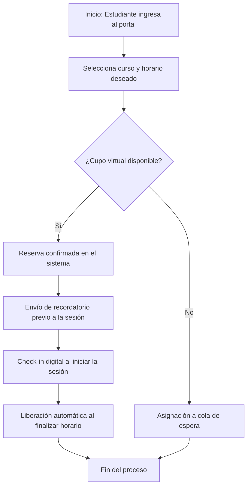

# UNIVERSIDAD NACIONAL DE SAN AGUSTÍN DE AREQUIPA
## Escuela Profesional de Ingeniería de Sistemas

### PROPUESTAS DE ORGANIZACIÓN Y PROCESOS PARA LABORATORIOS

**Proyecto:** Plataforma de Gestión de Laboratorios

**Curso:** Organización y Métodos

**Docente:** Ing. Juan Juárez Bueno

**Integrantes:**
- Baca Calsin Leonardo Juan José
- Chipana Jeronimo German Arturo
- Palma Apaza Santiago Enrique
- Mejia Rondan Giovanni Patrick
- Ponce Llerena Renato Xavier
- Auccacusi Conde Brayan Carlos
- Aragon Carpio Fredy Jose

**Fecha:** Julio 2026

---

## Índice

1. [Introducción](#1-introducción)
2. [Objetivos](#2-objetivos)
3. [Alcance](#3-alcance)
4. [Diagnóstico Actual](#4-diagnóstico-actual)
5. [Propuestas de Mejora](#5-propuestas-de-mejora)
6. [Definición de Organización y Roles](#6-definición-de-organización-y-roles)
7. [Procesos de Gestión de Laboratorios](#7-procesos-de-gestión-de-laboratorios)
8. [Conclusiones](#8-conclusiones)
9. [Recomendaciones](#9-recomendaciones)

---

## 1. Introducción

La correcta administración de los laboratorios de computación en el ámbito universitario es un desafío constante. La presente documentación propone un modelo organizativo y procedimental fundamentado en enfoques ágiles, específicamente adaptando el Modelo Spotify al contexto académico. Este documento ha sido elaborado en respuesta a la consigna académica del curso de Organización y Métodos (Punto 2.1), buscando plantear un rediseño estructural formal y fundamentado.

Esta propuesta surge de la necesidad de mitigar problemas recurrentes, como la fragmentación de entornos de desarrollo, la pérdida de tiempo en configuraciones manuales y la ausencia de trazabilidad en el software utilizado durante las sesiones prácticas. El diseño aquí presentado busca equilibrar la autonomía de los equipos de desarrollo con la alineación estratégica que requiere la institución, garantizando así un entorno educativo más eficiente y moderno.

## 2. Objetivos

### 2.1 Objetivo General
Diseñar una estructura organizacional ágil y definir los procesos operativos fundamentales para la Plataforma de Gestión de Laboratorios, orientada a estandarizar los entornos virtuales de los estudiantes y optimizar el uso de los recursos de software académicos.

### 2.2 Objetivos Específicos
- Establecer roles claros y responsabilidades bajo una adaptación académica del Modelo Spotify.
- Definir un modelo de gobernanza organizativa que resuelva los cuellos de botella en la gestión de laboratorios.
- Documentar, mediante estándares visuales (BPMN), los procesos de solicitud de imágenes de contenedores y la gestión de horarios.
- Delimitar el alcance técnico exclusivamente hacia la capa lógica y de software de los laboratorios, descartando la gestión física para evitar corrupciones en el alcance del proyecto.

## 3. Alcance

Este documento abarca exclusivamente el diseño de la estructura organizacional de los equipos de desarrollo y la formalización de los procesos operativos (reserva de horarios y solicitud de imágenes). Se restringe a la gestión de la capa lógica y de *software*, quedando fuera de su alcance la administración, inventario o mantenimiento del *hardware* físico de los laboratorios.

## 4. Diagnóstico Actual

### 4.1 Inconsistencias en el modelo base
A partir del análisis de la documentación técnica inicial y las revisiones del equipo, se detectaron áreas de mejora en el planteamiento teórico original:
- **Ausencia de Gobernanza Central:** El planteamiento ágil inicial no definía formalmente un liderazgo transversal que coordine prioridades, lo que generaba un riesgo de desalineación entre los diferentes *squads*.
- **Vaguedad en los Roles de Procesos:** No existía un responsable claro (dueño de procesos) que se encargara de documentar y auditar los procedimientos administrativos (como las reservas o la creación de imágenes).

### 4.2 Problemas de alcance (Hardware vs. Software)
Se identificó una contradicción fundamental entre los objetivos de alto nivel y la arquitectura técnica propuesta. Originalmente, se incluyó la gestión del ciclo de vida del hardware físico (inventarios, mantenimiento). Sin embargo, al tratarse de un entorno académico con herramientas orientadas a *software* (como Docker, GitLab o Proxmox), mantener la gestión de hardware físico representaba un desvío del propósito principal y un riesgo significativo de incremento no controlado del alcance (*scope creep*).

## 5. Propuestas de Mejora

### 5.1 Redefinición del alcance técnico
Se propone concentrar los esfuerzos organizacionales y de desarrollo exclusivamente en la provisión, gestión y auditoría de **entornos lógicos** (imágenes de contenedores y máquinas virtuales). Toda responsabilidad sobre el estado físico de los equipos, su inventario y mantenimiento queda fuera de la plataforma, delegándose a la administración tradicional de la facultad.

### 5.2 Consolidación de documentación
Para mantener la integridad de la información y adherirse al principio *DRY (Don't Repeat Yourself)*, se propone consolidar toda la visión general del sistema en un único archivo maestro (`README.md`), eliminando cualquier archivo redundante que genere discrepancias funcionales o de alcance en el equipo.

## 6. Definición de Organización y Roles

El modelo organizativo adopta el marco de Spotify, ajustado para considerar la dinámica de estudiantes y docentes en un ciclo semestral.

### 6.1 Estructura base (Modelo Spotify)
La organización se compone de las siguientes unidades interconectadas: **Tribe** (tribu), **Squads** (escuadrones), **Chapters** (capítulos) y **Guilds** (gremios). Esta matriz permite que los estudiantes operen verticalmente (entregando valor) y horizontalmente (desarrollando habilidades técnicas y estandarizando procesos).

### 6.2 Tribe Lead y coordinación general
- **Tribe (Platform Lab):** Agrupa a todos los equipos encargados del proyecto.
- **Tribe Lead:** Será un rol rotativo ocupado por un docente coordinador o un estudiante de nivel avanzado (Tech Lead). Su función primordial es actuar como facilitador, resolviendo dependencias bloqueantes entre los squads y garantizando que el esfuerzo se alinee con el calendario académico.

### 6.3 Squads (Fase Universitaria y Fase Empresa)
Equipos multidisciplinarios de 5 a 9 integrantes con alta autonomía técnica.
- **Fase 1 (Universitaria):** Orientada a construir la funcionalidad base. Incluye:
  1. *Squad Core Platform* (Infraestructura base).
  2. *Squad Image & Container Management* (Gestión del ciclo de vida de Docker).
  3. *Squad Lab Operations* (Gestión de reservaciones lógicas).
  4. *Squad Frontend & User Experience* (Portal de usuario).
- **Fase 2 (Evolución recomendada):** Ampliación orientada a integrar estándares profesionales más rigurosos, consolidando áreas de integración y experiencia empresarial.

### 6.4 Chapters y el nuevo "Chapter de Organización y Procesos"
Agrupaciones horizontales por especialidad técnica, lideradas por docentes evaluadores:
1. *Chapter Backend & Arquitectura*
2. *Chapter DevOps & Platform Engineering*
3. *Chapter Frontend & UX*
4. **Chapter de Organización y Procesos:** Liderado por un docente de O&M. Se encarga de velar por la coherencia de la documentación, las métricas de desempeño (KPIs) y la definición de las políticas de uso del laboratorio.

### 6.5 El rol del "Process Owner" por Squad
Para evitar la burocratización, no existirá un equipo aislado de procesos. En su lugar, cada squad designará a un estudiante como **Process Owner**. Este estudiante, con apoyo del *Chapter de Organización*, dedicará parte de sus horas a documentar los flujos técnicos y decisiones tomadas por su propio equipo.

### 6.6 Guilds de interés transversal
Se propone la creación voluntaria del **Guild de Seguridad**. Será una comunidad transversal de estudiantes interesados en ciberseguridad, quienes se encargarán de investigar y proponer mejoras en la auditoría de imágenes y buenas prácticas de autenticación.

## 7. Procesos de Gestión de Laboratorios

Para modelar la operación, se han diseñado flujos de procesos esenciales que dictan cómo interactúan los actores con el sistema.

### 7.1 Solicitud de Imágenes para Cursos

Proceso mediante el cual un docente o estudiante solicita un entorno contenerizado para uso masivo.

### 7.2 Gestión de Horarios y Reservas

Proceso que garantiza la disponibilidad lógica y virtual de los laboratorios para evitar saturaciones del servidor central.

### 7.3 Gestión de Proyectos
Cada laboratorio se estructurará por "Proyectos" (equivalente a cursos o talleres). El docente (Product Owner del proyecto) tendrá autoridad para asignar imágenes predefinidas a su proyecto, asegurando que todos los estudiantes matriculados trabajen exactamente con la misma versión del software.

### 7.4 Matriz RACI de Procesos

| Actividad / Proceso | Tribe Lead | Process Owner | Estudiante | Docente Evaluador |
| :--- | :--- | :--- | :--- | :--- |
| **Definición de Organización** | A | R | I | C |
| **Solicitud de Nuevas Imágenes** | I | R | R | A |
| **Actualización de Documentación** | I | A/R | I | C |
| **Aprobación de Reserva Virtual** | I | C | R | I |

*(R: Responsable, A: Aprobador/Rinde Cuentas, C: Consultado, I: Informado)*

## 8. Conclusiones

- El diseño organizacional debe reflejar la naturaleza compleja y académica del proyecto. La adaptación del Modelo Spotify, incorporando un *Tribe Lead* y *Process Owners* distribuidos, garantiza un equilibrio real entre el avance técnico de los estudiantes y el control de calidad académico.
- Delimitar el sistema exclusivamente a una plataforma lógica (software, imágenes, reservas virtuales) previene la sobrecarga del proyecto y asegura resultados factibles dentro de la duración de un semestre universitario.
- Los procesos formalizados, como la solicitud de imágenes y la reserva de cupos, son la base para un laboratorio predecible y estandarizado, disminuyendo la fricción operativa del día a día.

## 9. Recomendaciones

- **Continuidad de Conocimiento:** Se recomienda establecer un proceso formal de *handoff* (traspaso) al finalizar cada semestre. Los *Process Owners* actuales deben documentar las lecciones aprendidas para el grupo de estudiantes del semestre siguiente.
- **Implementación Gradual:** Se sugiere iniciar la adopción de estos procesos mediante un piloto en un solo curso antes de expandir el uso de la plataforma a toda la Escuela Profesional.
- **Evaluación de Herramientas Futuras:** A medida que la organización gane madurez, se recomienda la evaluación de herramientas profesionales de automatización (como escáneres de seguridad y validadores de licencias) para robustecer la plataforma.
